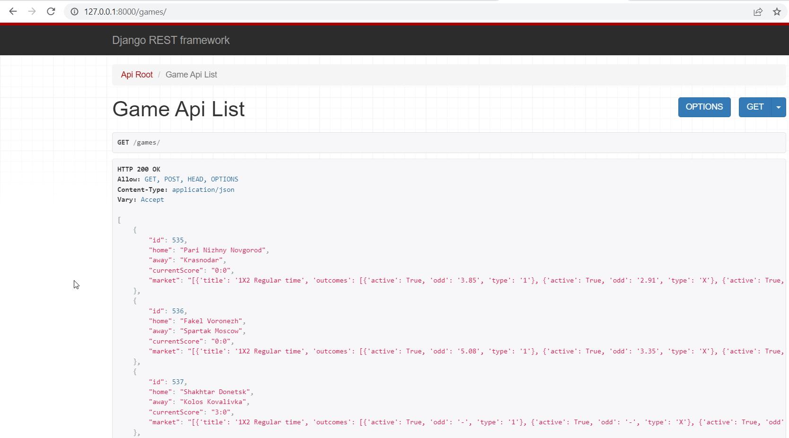

# 1xBet scraping

Django project, which scrapes data from 1xbet.com to DRF localhost


## Installation

Python3 must be installed

```shell
git clone https://github.com/LaskoA/DevPort1xBet.git
cd DevPort1xBet

Virtual environment install for Windows:
  - python3 -m venv venv
  - source venv/bin/activate
  - pip install -r requirements.txt
  
Virtual environment install for Mac:
  - sudo pip install virtualenv
  - virtualenv env
  - source env/bin/activate
  
python manage.py runserver
python manage.py makemigrations
python manage.py migrate
```

## Description

- shows data about teams, current score and bets for market "1X2 к Regular time"
- once server is up, you can see updated queryset on http://127.0.0.1:8000/games/


## Demo

